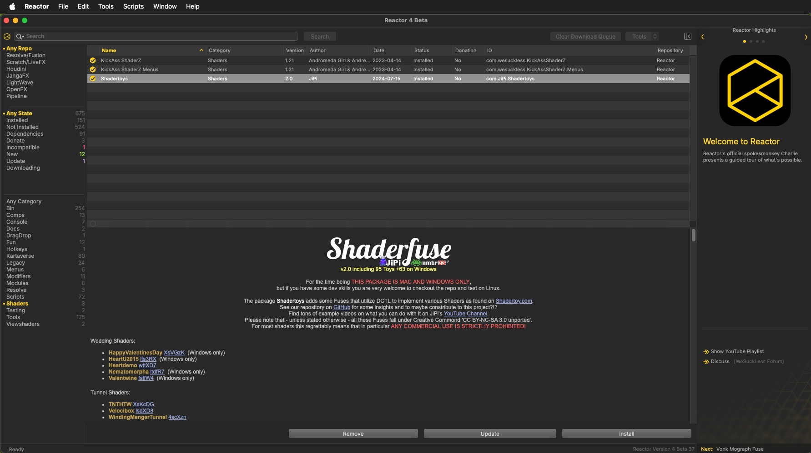

# Reactor Atom Packages

The [Reactor Standalone](https://github.com/Kartaverse/Reactor-Standalone) is a package manager created by the We Suck Less Community for BMD Fusion Studio, Resolve (Free), Resolve Studio, OpenFX, JangaFX, SideFX Houdini, and LightWave. Reactor streamlines the installation of 3rd party content through the use of "Atom" packages that are synced automatically with a Git repository.

Reactor has been revamped as a desktop application that works seamlessly on macOS, Windows, and Linux. 

Reactor Standalone is compatible with Resolve Free v15 - v20+, Resolve Studio v15 - v20+, and Fusion v9.0.2 to v20+. This dedicated standalone desktop application version of Reactor helps solve the UI manager scripting dependency issue that was present with Resolve Free v19.1 - 20.

> Search by keyword or use the menu on the left to go through all available atom packages.
>
> Enjoy!
>

