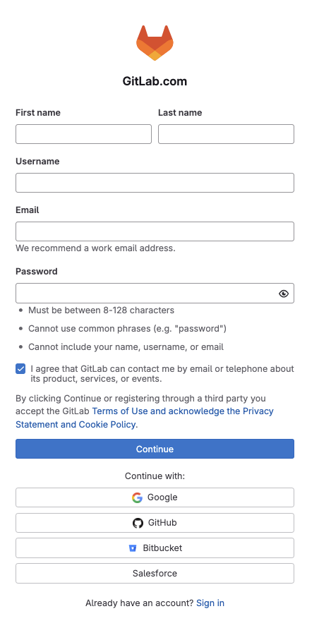
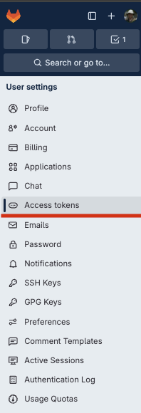
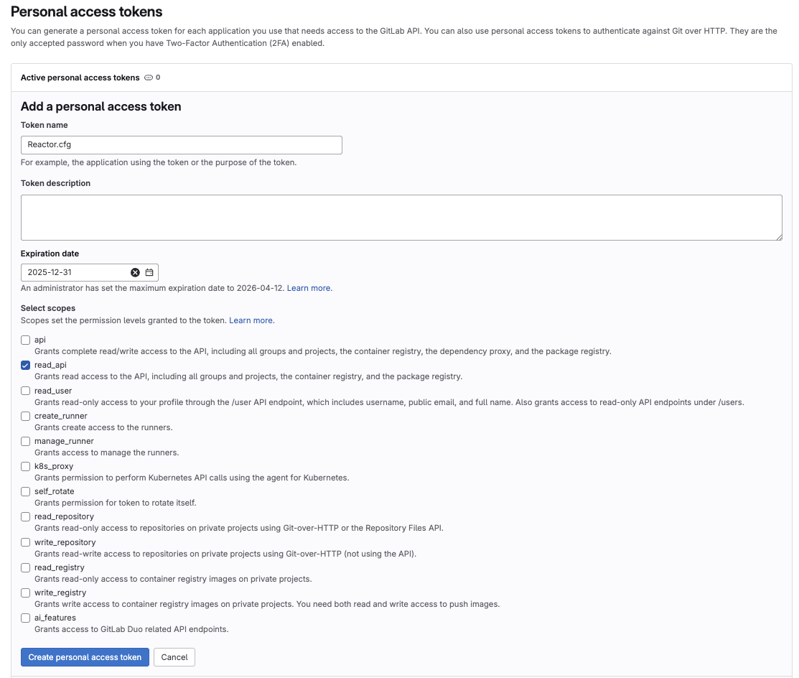
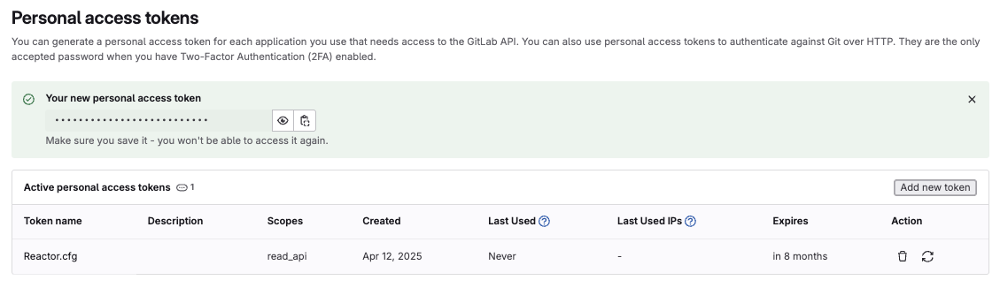

# Reactor SPEED Boost Guide

## Accelerating Reactor Installs

Today is a big day for Reactor power-users. We are finally able to bring back a classic feature that allows for improved Reactor startup times, and blazing fast atom package installs.

## History Note

Back in 2018 Reactor supported an accelerated downloading system called multi-stream or multi-socket downloads. This made better use of a highspeed internet connection by splitting the atom package installation process into several concurrent internet file transfer requests from the GitLab repository. This feature relied on the GitLab API's ability to support a higher connection usage level.

A few years ago GitLab changed their policy for how many simultaneous internet connections a user could have, if they were not logged into the GitLab site.

Since Reactor runs by default with an unauthenticated GitLab user session, it caused a hard clamp on the usage levels which meant we needed to run with a single socket connection for all Reactor GitLab repository internet requests. This slowed down all file transfers for atom package installs and updates by an order of magnitude.

GitLab offers a solution to this issue but it takes a bit of work by the end user, since you need to use a feature called a GitLab personal access token. This process makes it possible to run Reactor with an authenticated GitLab session.

## Overview

Lets explore a Reactor Package Manager workflow that allows you to get a massive boost in your atom package download speeds. The process involves adding a custom GitLab "Personal Access Token" to the "Reactor:/System/Reactor.cfg" file.

A GitLab "Personal Access Token" allows you to avoid the GitLab usage limits that clamp the number of active socket connections you can have when making GitLab API requests.

If you go though the following 5-step process, Reactor will be able to use more concurrent download sockets when installing and updating atom packages. This results in a 10x faster experience when using Reactor.

[h2]Step by Step[/h2]

Step 1. [url=https://gitlab.com/users/sign_up]Register for a free GitLab account[/url]. GitLab is the service that hosts the Reactor package manager repository.

Step 2. Open your [url=https://gitlab.com/-/user_settings/personal_access_tokens]GitLab account[/url] preferences and click on the "Access Token" sidebar link. Then click on the "Add new token" button at the top right corner of the webpage.

Step 3. Type a string like "Reactor.cfg" into the "Token Name" field. This lets you remember what the token is used for.

Set an "Expiration date" for several months from now. This defines how long the token is valid for. You might choose an expiration date like "Dec 31st" of the current year.  When a token eventually expires, you can go back to the GitLab website and re-generate a new one.

In the "Select Scopes" section enable the "read_api" checkbox to allow this access token to read the GitLab API.

Then click the blue "Create personal access token" button.

Step 4. On the personal access token webpage there will be a message that lists "Your new personal access token". This message is written inside a green box region at the top of the webpage. 

Click the "eye" button icon to see the unmasked access token text. You can click the clipboard button icon to copy the access token into your copy/paste clipboard.

Step 5. Navigate to the Reactor package manager folder on your hard drive. Then hop inside the "Reactor:/System/" Pathmap folder and open the "Reactor.cfg" file up in a programmer's text editor.

This is what a typical "Reactor.cfg" file looks like:

    {
        Repos = {
            _Core = {
                ID = 5058837,
                Protocol = "GitLab",
                PrevCommitID = ""
            },
            Reactor = {
                ID = 5058837,
                Protocol = "GitLab",
                PrevCommitID = ""
            },
        },
        Settings = {
            Reactor = {
                NewForDays = 7,
                PrevSyncTime = 1744457139,
                ViewLayout = "Larger Description View",
                ConcurrentTransfers = 1,
                AskForInstallScriptPermissions = true,
                LiveSearch = true,
                MarkAsNew = true
            }
        }
    }

We are going to edit the Repos table entries to add a "Token" key/value pair to both the "_Core" and "Reactor" sections. The "_Core" section defines where the "Reactor.lua" script is downloaded from, and the "Reactor" section defines where the Reactor atom package content is downloaded from.

It is possible to add your own custom public or private GitLab repos to Reactor by adding additional Repo entries. The key thing is the "ID" tag is used to enter a GitLab repository's project ID. Here is an example of the Vonk Ultra project repo:

    Vonk = {
        ID = 34114155,
        Protocol = "GitLab",
        PrevCommitID = ""
    }

Here is a template that shows a modified "Reactor.cfg" file with the placeholder Token fields added. The text "ENTER-YOUR-GITLAB-TOKEN-ID-HERE" can be replaced with your actual GitLab "Personal Access Token" ID code.

Additionally, in the "Settings.Reactor" section of the Reactor.cfg file, there is a "ConcurrentTransfers" key/value pair that lets you define how many download sockets are used at the same time. If you have a GitLab personal access token this value can be changed from 1 to 10. This will result in a ~10x speedup on atom package installs.

    {
        Repos = {
            _Core = {
                ID = 5058837,
                Token = "ENTER-YOUR-GITLAB-TOKEN-ID-HERE",
                Protocol = "GitLab",
                PrevCommitID = ""
            },
            Reactor = {
                ID = 5058837,
                Token = "ENTER-YOUR-GITLAB-TOKEN-ID-HERE",
                Protocol = "GitLab",
                PrevCommitID = ""
            },
        },
        Settings = {
            Reactor = {
                NewForDays = 7,
                PrevSyncTime = 1744457139,
                ViewLayout = "Larger Description View",
                ConcurrentTransfers = 10,
                AskForInstallScriptPermissions = true,
                LiveSearch = true,
                MarkAsNew = true
            }
        }
    }

The next time you open the Reactor GUI in Resolve/Fusion you will be running with the modified access token and concurrent transfers settings. You should see a big improvement in atom package install and update speeds.
